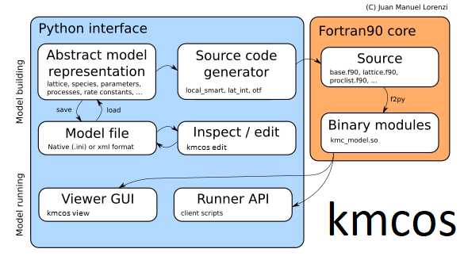

Welcome to kmcos's documentation!
================================

  Things you can do with kmcos.

kmcos is a vigorous attempt to make (lattice) kMC modelling more accessible.

kmcos is designed for and by kMC model developers. As of this writing there
is no standardized way to develop kMC models, thus there is no standardized
way to use kmcos. kmcos can be an Editor, an API, a viewer. However all in all
kmcos wants to save time filled with repetitive labor and enlarge your stride.

Not sure how to begin? Start with the :ref:`API tutorial <api-tutorial>`.

.. toctree::
   :maxdepth: 0
   installation/index 
   tutorials/index
   topic_guides/index
   reference/index
   troubleshooting/index
   troubleshooting/faq

.. |date| date:: %b %d, %Y

This document was generated |date|.
